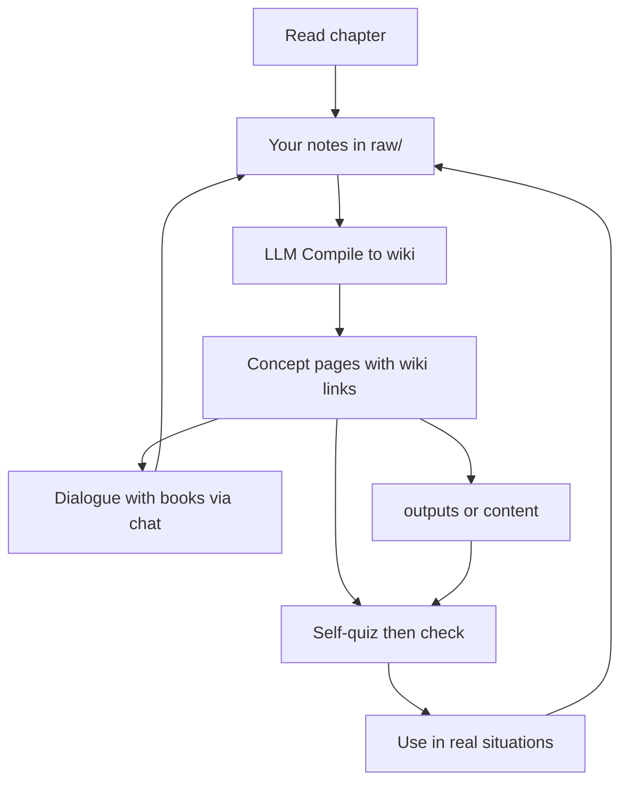

# Master book knowledge through this project

Mastery here is not “finish the book.” It is: **encode → structure → retrieve → apply → teach**, with the LLM doing filing and cross-links while **you** stay the learner.

Your Stoicism stack already demonstrates this: chapter notes in [`raw/2026-04-07-notes-on-stoicism.md`](raw/2026-04-07-notes-on-stoicism.md) → concept pages like [`wiki/dichotomy-of-control.md`](wiki/dichotomy-of-control.md) → `make ingest` / chat for retrieval.

## Todo checklist

- [ ] After each chapter: short `raw/` note (bullets + 1 personal hook + concept names)
- [ ] Weekly `make sync` → skim new wiki pages; correct emphasis only
- [ ] Dialogue 1–2x/week: argue, bring a life scene, or put two books in tension (cite-only)
- [ ] Weekly 3 self-quiz queries (answer first, then check wiki/chat)
- [ ] Apply one concept in life; dump outcome to `raw/`; re-compile
- [ ] Monthly `make audit` + one `outputs/` synthesis from wiki only

## The loop (per chapter, not per book)

### 1. Capture — you write, briefly
After each chapter, add a short note under `raw/` (same style as your Stoicism notes):
- 3–7 bullets of **what stuck** (not a transcript)
- 1 personal example or disagreement
- Names of concepts you want as pages (e.g. “消极想像”, “dichotomy of control”)

Do not ask the LLM to summarize the whole chapter for you first. Passive summary ≠ mastery. Your sparse notes are the seed.

### 2. Compile — LLM files and connects
Run `make sync` (prompt → agent per [`AGENTS.md`](AGENTS.md)):
- Create/update one wiki page per concept/theme/character
- Link with `[[wiki links]]`
- Fill Sources (book passage + your `raw/` note)
- Flag contradictions with earlier pages

**You review** the new/changed pages once. Fix wrong emphasis; leave filing to the model.

### 3. Dialogue — talk *with* the books (not about summaries)
This is the living core: AI speaks **as a grounded voice of the books you are currently reading**, with citations **only from that active set**. You push, test, and disagree.

**Hard rule — citation allowlist**
- AI may cite **only** the book(s) marked active (primary, plus any satellite you explicitly include for this dialogue).
- Not allowed in dialogue cites: other shelf books, wiki pages, `raw/` notes, or the model’s general knowledge dressed up as a quote.
- If the active books don’t cover the question, the AI must say **“not in the books you’re reading”** — not invent Marcus or pull Irvine when Irvine isn’t active.
- Wiki / `raw/` are for **Compile and your own memory**, not for the AI to quote back at you as if they were the book.

Today Steady Mind retrieves across the whole index; for study dialogue, state the allowlist in the prompt (e.g. “Cite only *Daily Stoic*”). True enforcement later = RAG filter by active book IDs.

**Active set = what you’re reading now**

| Slot | Cite in dialogue? |
|------|-------------------|
| Primary | Always |
| Satellite you invited into this chat | Yes, for this session only |
| Dormant / familiar but not reading | No |

**Three dialogue modes**

| Mode | You say | Good for |
|------|---------|----------|
| **Argue** | “I don’t buy X — here’s why. Steelman *this book*, then answer me.” | Catching shallow agreement |
| **Situation** | “Here’s what happened… Answer only from [active book(s)]. What’s in my control?” | Primary + apply |
| **Books in tension** | Only when **both** are in the active set: “Meditations vs Daily Stoic on attachment — clash on *my* case.” | Comparing books you are actually reading |

**Rules so it stays mastery, not cosplay**
- Name the allowlist every session: “Active books: Daily Stoic [, Meditations]. Cite only these.”
- You speak first with *your* take or *your* scene; don’t open with “explain chapter 5.”
- After a good exchange, dump 3–5 lines into `raw/` (insight, disagreement, open question) so Compile can update the wiki. Dialogue that never returns to `raw/` evaporates.

**Prompt starters**
- “Cite only *The Daily Stoic*. I think indifference to reputation means never caring what people think — challenge me from the book.”
- “Active: Daily Stoic only. Quiz me on control vs not-control; don’t reveal answers until I reply.”
- “Active: Meditations + Daily Stoic. I felt insulted at work. Short dialogue — you as the texts, me as myself. One question at a time. No other sources.”

### 4. Retrieve — force recall before rereading
Days later, quiz yourself (answer first), then check chat or `make query MSG='...'`:
- “What is dichotomy of control in my words?”
- “How does negative visualization relate to attachment?”
- “What did I disagree with in ch2?”

If the check is only book quotes and no *your* framing, your wiki page is thin — strengthen the page or your next `raw/` note.

### 5. Apply — put one idea into life
For practice books (Stoicism, money, leadership): pick **one** concept that week and use real friction (or a Situation dialogue) as the exam. Afterward, dump 5 lines into `raw/` (“tried X when Y happened”). Re-compile so application becomes part of the concept page.

### 6. Teach — write from the wiki, not the book
When a cluster of pages feels solid, ask for an `outputs/` brief or a blog draft **only from wiki + your notes**. Teaching exposes gaps Audit can then fix (`make audit`: orphans, missing `[[links]]`, contradictions).

## What “mastered” looks like in this repo

| Signal | Meaning |
|--------|---------|
| Concept has a wiki page with Sources + Related Topics | Encoded and placed in the graph |
| You can answer a query without opening the book | Retrievable |
| A later `raw/` note cites a real use of the idea | Applied |
| Two books link to the same concept page | Integrated (e.g. Irvine + Daily Stoic → one [[negative-visualization]]) |
| Audit finds few missing pages for that topic | Graph is coherent |

Aim for **depth on one topic wiki** (Stoicism first), not many shallow book dumps. Topic-specific wikis keep the graph clean (as in your [`notes.md`](notes.md)).

## Main book + books you already know

You will often be **mainly in one book** while several others are already familiar. That is fine. Do not force “one book only” or “finish A before opening B.”

**Rule:** one *primary* book for capture cadence; others are **satellites** that feed the same topic pages.

| Role | What you do | What AI does |
|------|-------------|--------------|
| **Primary** (current read) | Chapter → `raw/` note every time | Compile new/updated concept pages |
| **Satellite** (already know / skim / revisit) | Only note when something *connects, contradicts, or sharpens* the primary | Merge into **existing** wiki pages (new Sources row), not a new book dump |
| **Dormant** (on the shelf) | Ignore until it becomes primary or a satellite hit | Nothing |

Examples (Stoicism): primary = *Daily Stoic* this month; Irvine / Meditations / Carlson are satellites — when a chapter echoes 消极想像, add 2–3 lines in `raw/` pointing at that concept, then sync so [[negative-visualization]] gains another source instead of a parallel summary.

**Multi-book mastery signal:** the wiki page lists 2+ books in Sources and you can say how they differ in one sentence. Familiarity without a Sources row is still just memory; the page is what locks it in.

Switch primary when you stop capturing for 1–2 weeks, or when a life theme (money, dating) needs a different topic wiki — not because you finished every page of the last book.

## Practical cadence

- **While reading:** 10–15 min capture after each chapter
- **Weekly:** one Compile + skim of new wiki pages
- **Weekly:** 1–2 dialogues (argue / situation / books in tension) + fold hits into `raw/`
- **Weekly:** 3 self-quizzes (you answer first, then check)
- **Monthly:** Audit + one short `outputs/` synthesis
- **After ~30–50 solid pages:** the wiki itself becomes your study surface; book rereads are for filling holes, not first learning

## LLM’s job vs yours

- **You:** select, struggle, argue, apply, correct wrong pages; speak first in dialogue; choose the active-book allowlist
- **LLM:** voice **only those books** *with cites*, refuse out-of-allowlist quotes, organize wiki offline from dialogue, quiz without spoiling

If the model does all the writing and you only approve, you get a fan wiki you don’t own mentally. Keep capture, dialogue initiative, and application human.

## Start from where you are (Stoicism)

You already have the right shape. Next mastery moves, in order:
1. Finish filing open TODOs in existing `raw/` Stoicism notes into wiki concepts
2. After each new chapter of *Daily Stoic* / Irvine / Meditations: capture → sync → 3 self-quiz queries
3. Use emotion moments in life (or Steady Mind chat) as apply-tests; fold results back into `raw/`
4. Only then open a second topic wiki (money / leadership) with the same loop

No new product code required for mastery—the harness (`raw/`, `wiki/`, Compile, Audit, Query, ingest) is already the study system.
