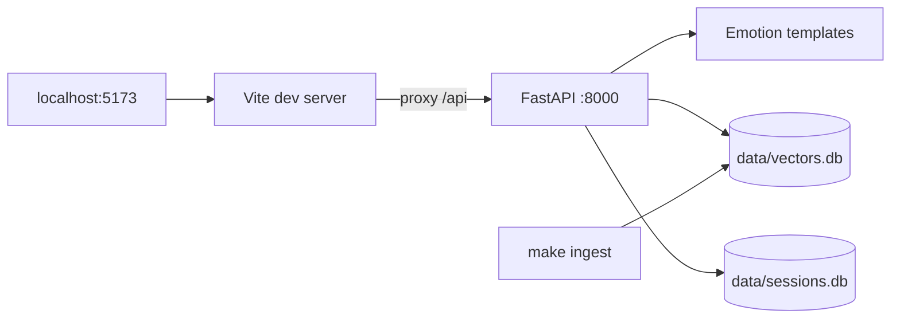
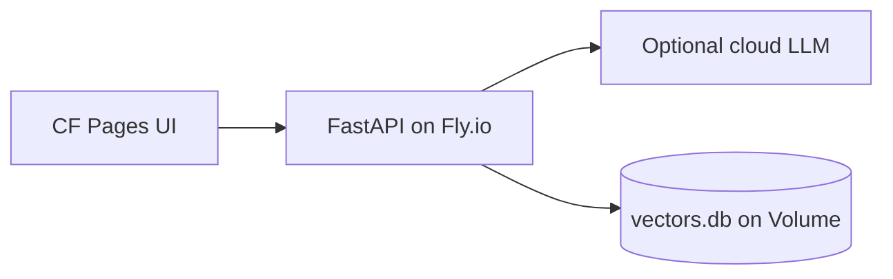
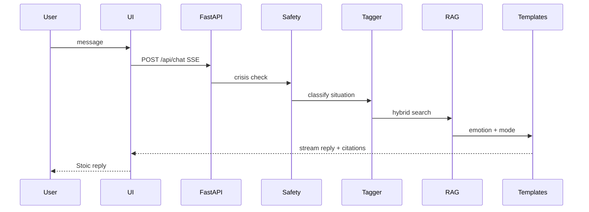
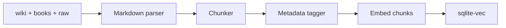
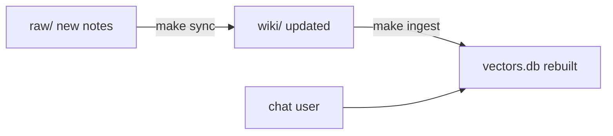

# 穩心 Steady Mind — Technical Plan

> **穩心** — 以斯多葛哲思陪伴情緒，整理當下的处境。面向中文世界（繁 / 简）；英文 **Steady Mind**。非临床心理治疗。

**Product tier:** Personal tool → **Friends beta (~5–20 people)** → public SaaS only if needed later.

**Development strategy:** **Local-first** — build and validate on your Mac (RAG + template replies + FastAPI + local UI). Deploy to **CF Pages + Fly.io** only when chat experience is good enough for friends.

---

## 1. Overview

### Branding

| Field | 繁體 | 简体 |
|-------|------|------|
| **主名称** | **穩心** | **稳心** |
| **副标题** | 斯多葛情緒哲思 | 斯多葛情绪哲思 |
| **标语** | 用哲學整理情緒，在可控處用力 | 用哲学整理情绪，在可控处用力 |
| **英文名** | **Steady Mind** | **Steady Mind** |
| **英标** | Stoic wisdom for everyday emotions | (same) |

| 技术项 | 值 |
|--------|-----|
| **CF Pages** | `https://steady-mind.pages.dev` |
| **Fly.io** | `steady-mind-api` → `https://steady-mind-api.fly.dev` |
| **默认语言** | `zh-Hant`（繁体）；支持 `zh-Hans` 切换 |
| **API** | `lang: "zh-Hant" \| "zh-Hans" \| "en" \| "auto"` |

Naming rationale → [Appendix A](#appendix-a-branding-notes).

### Design Philosophy: Thin Harness, Fat Skills

The project follows **[Thin Harness, Fat Skills](https://x.com/garrytan/status/2042925773300908103)**:

- **Thin Harness (code):** FastAPI, React, vector retrieval, SQLite — thin, generic, no complex agentic loops.
- **Fat Skills (content):** Stoic knowledge (`wiki/` + `books/` + `raw/`) and behavior (`prompts/stoic_guide.md`).

Improve the guide by editing Markdown and prompts, not by growing the codebase.

### Implementation Checklist

| Stage | Work | Done when |
|-------|------|-----------|
| **A1** | `scripts/ingest.py` + hybrid retriever + CLI query | Relevant chunks for test prompts |
| **A2** | FastAPI `/api/chat` SSE + RAG + safety + sessions | Grounded reply with citations |
| **A3** | Vite + React UI; `make site` | Browser chat at `:5173` |
| **A4** | Tune emotion templates in `services/prompt.py` | Good replies for anger/grief/insult |
| **B1** | Optional cloud LLM + prod embeddings | Same API, add provider when needed |
| **B2** | Fly.io + Volume + secrets | `fly deploy` live |
| **B3** | CF Pages + `VITE_API_URL` | Static UI → Fly API |
| **B4** | Friends beta gate | Password, rate limits, disclaimer |

**Stage B gate:** RAG quality good; replies follow `stoic_guide` feel/decide modes with citations; you'd use it daily; crisis path works. Then deploy (~$4–8/mo). Details → [Appendix B](#appendix-b-stage-b-deploy).

**Stage C (ongoing):** Daily Stoic notes in `raw/` → re-ingest; Meditations Chinese retrieval; emotion starter buttons; fine-tune on wiki at 100+ pages.

---

## 2. Thin Harness — Code

Generic scaffolding. RAG, emotion routing, safety, and reply templates stay thin; improve behavior by editing templates and content, not by adding layers.

### Architecture

**Stage A (now):** Everything on Mac. No Cloudflare, Fly.io, or API keys. **$0.**



**Stage B (later):** Same API; optional cloud LLM; add CF Pages + Fly.io.



**Request flow (one message):**



### Stack & Persistence

| Layer | Choice | Notes |
|-------|--------|-------|
| **Product** | Personal companion web app | Jamstack + API; not blog/wiki |
| **Frontend** | Vite + React + TS + Tailwind | CF Pages friendly; SSE |
| **Backend** | FastAPI + Python 3.11+ | Same codebase dev & prod |
| **Replies** | Emotion templates (`services/prompt.py`) | Deterministic feel/decide modes |
| **Embeddings** | multilingual-e5-small (Mac MPS) | Free at ingest + query |
| **Vector DB** | SQLite (`data/vectors.db`) | ~500 chunks; numpy cosine in Python |
| **Session DB** | SQLite (`data/sessions.db`) | Last 6 turns |
| **Hosting prod** | Fly.io (~$3–5/mo) | Always-on + Volume; Stage B only |
| **Repo** | GitHub (`dev.research`) | Code + content |
| **Audience** | You → friends beta | No SaaS until needed |

**`vectors.db` fields:** `id`, `text`, `embedding`, `source` (`wiki`, `daily_stoic`, `meditations`, `irvine_notes`), `concept`, `emotions`, `lang`, `priority`.

**`sessions.db` fields:** `session_id`, `role`, `content`, `created_at`. No accounts in beta; optional 30-day TTL.

**Why SQLite:** single-file; copy to Fly Volume after local ingest; same files local & prod; no DB server.

**Data flow:**

```
make ingest  →  wiki/ + books/  →  embed  →  vectors.db
chat query   →  embed message  →  search vectors.db  →  top chunks  →  template reply
chat turns   →  sessions.db
```

### API

```
POST /api/chat
  body: { session_id, message, lang?: "en"|"zh"|"auto" }
  headers: { X-Beta-Token: "..." }   # friends beta
  response: SSE { type: "token"|"citation"|"done", data }

GET  /api/health
POST /admin/reindex    # dev only
```

**Session memory:** last 6 turns in `sessions.db`; older turns summarized to 3 sentences. `session_id` UUID in `localStorage` — no login.

### Local Dev

```bash
make ingest && make site   # :5173 UI → :8000 API, e5-small embeddings, $0
```

```ts
// vite.config.ts — dev proxy avoids CORS
server: { proxy: { '/api': 'http://127.0.0.1:8000' } }
```

No Cloudflare, Fly.io, or `GEMINI_API_KEY` until Stage B.

### Stage B Summary

> **You are here:** Stage A. Skip deploy until local chat works.

```
GitHub push
    ├── CF Pages  →  https://steady-mind.pages.dev      (static UI, free)
    └── Fly.io    →  https://steady-mind-api.fly.dev    (FastAPI + RAG + Gemini)
```

CF Pages serves static UI only; FastAPI, Gemini, and sqlite live on Fly.io (Volume at `/data`).

| Ready? | Signal |
|--------|--------|
| ✅ | RAG returns relevant wiki/book chunks |
| ✅ | Template replies follow feel/decide modes and show citations |
| ✅ | You'd use it after a bad day |
| ✅ | Safety/crisis path behaves correctly |

Full fly.toml, Dockerfile, env vars → [Appendix B](#appendix-b-stage-b-deploy).

### Repo Layout

```
dev.research/
├── plan.md
├── app/
│   ├── backend/
│   │   ├── main.py
│   │   ├── config.py
│   │   ├── routes/chat.py
│   │   ├── services/
│   │   │   ├── tagger.py        # emotion routing
│   │   │   ├── retriever.py
│   │   │   ├── prompt.py        # reply templates
│   │   │   ├── embedder.py
│   │   │   ├── safety.py
│   │   │   └── session.py
│   │   └── models/schemas.py
│   └── frontend/
│       ├── src/
│       │   ├── App.tsx
│       │   ├── components/Chat.tsx
│       │   └── hooks/useChatStream.ts
│       └── package.json
├── scripts/
│   ├── ingest.py
│   ├── query.py
│   └── chunkers/
├── data/                        # gitignored
│   ├── vectors.db
│   └── sessions.db
├── prompts/
│   └── stoic_guide.md           # reference / future tuning
├── books/
├── wiki/
├── raw/
└── Makefile                     # ingest | site | serve | query
```

---

## 3. Fat Skills — Content

Markdown + prompts + RAG quality. This is where the product gets smarter.

### What AI Does (and Does Not Do)

| Step | Uses AI? | Role |
|------|----------|------|
| Crisis detection | No (rules) | Stop + show hotlines |
| Situation routing | Rules (+ optional MLX) | Map message → `anger`, `grief`, `insult`, etc. |
| Vector retrieval | Yes (embeddings) | Find relevant wiki/book chunks |
| **Reply generation** | **Yes (core)** | Turn retrieved knowledge into guided conversation |
| Citations | Semi-auto | Chunks carry source metadata |

**AI is the Stoic guide** — markdown is the textbook, RAG is lesson prep, LLM delivers a structured lesson. Not a therapist; does not invent doctrine.

**Deliberately not AI:** disclaimers, crisis responses, knowledge storage, concept taxonomy.

### Ingestion



**Chunking rules:**

| Source | Split strategy | Metadata |
|--------|----------------|----------|
| `wiki/*.md` | One chunk per `###` section | `source=wiki`, `concept`, `priority=high` |
| `books/TheDailyStoic366Meditations.md` | Per `### January 1st **TITLE**` | `source=daily_stoic`, `date`, `theme` |
| `books/沉思录.md` | Per `# 卷 N` or paragraph groups | `source=meditations`, `volume`, `lang=zh` |
| `raw/2026-04-07-notes-on-stoicism.md` | Per `####` / `#####` section | `source=irvine_notes`, `topic`, `lang=zh` |

**Emotion/situation tags** (aligned with `wiki/INDEX.md`):

`anger`, `grief`, `insult`, `reputation`, `control`, `social_conflict`, `present_moment`, `negative_visualization`, `general`

Tag via rule-based filename + heading keywords (MVP); optional MLX classifier later.

**Hybrid retrieval:**

```
final_score = 0.5 * cosine_sim + 0.3 * concept_match + 0.2 * source_boost
```

- `source_boost`: wiki=1.0, irvine_notes=0.9, daily_stoic=0.8, meditations=0.7
- Return top **6 chunks** (~2k tokens context)

At `make ingest`, optionally export `data/chunks.json` for offline "browse by emotion" when API is down.

### Conversation

System prompt → [`prompts/stoic_guide.md`](prompts/stoic_guide.md).

**Situation → practice mapping:**

| User says | Route to | Key practices |
|-----------|----------|---------------|
| Anger at trivial things | `anger` | impermanence, don't waste life on anger |
| Grief / loss | `grief` | negative visualization, reason trims excess grief |
| Public insult | `insult` | truth-check, humor, ignore |
| Fear of judgment | `reputation` | internalize goals, indifference to opinion |
| Anxiety about outcome | `control` | three categories, internalize goals |

### Content Maintenance Loop



- **Compile** (`raw/` → `wiki/` via `AGENTS.md` workflows) keeps concepts current
- **Ingest** (`wiki/` + `books/` → vector DB) keeps chatbot knowledge current
- **Audit** catches wiki duplication before it pollutes retrieval

---

## 4. Ops

### Friends Beta

Small trial — gate + rate limits + privacy disclosure. No full SaaS.

**Access control:**

| Option | How | When |
|--------|-----|------|
| **A. Invite password (recommended)** | Frontend gate → `X-Beta-Token` header | 5–20 friends |
| **B. Cloudflare Access** | Email OTP on Pages URL | Zero backend auth code |
| **C. Secret URL only** | Share link privately | Lazy, weak security |

Also: `robots.txt` noindex; don't link from public blog.

**Session isolation:** `session_id` per browser; no accounts; no cross-device sync; optional 30-day TTL on `sessions.db`.

**Rate limits:**

| Limit | Value |
|-------|-------|
| Per `session_id` / hour | 20 messages |
| Per IP / day | 50 messages |
| Max message length | 2000 chars |
| Concurrent SSE per IP | 2 |

**Privacy (first visit):**

1. Philosophical tool, not therapy or crisis support
2. Conversations processed by cloud AI (Gemini) — avoid highly sensitive data
3. Crisis: call professional hotlines (988, etc.)

**Not building in beta:** registration, OAuth, admin dashboard, billing, chat export, public SEO.

### Safety

1. **UI disclaimer** on every session
2. **Crisis keyword detector** (rules): self-harm, suicide, abuse → stop LLM, show hotlines
3. **Scope limits** in `stoic_guide.md`: no diagnosis, no medication advice
4. **Grounding guard**: low retrieval score → "I don't have a strong passage for this"

### Risks & Success Criteria

| Risk | Mitigation |
|------|------------|
| Shallow MLX dev replies | Wiki-first retrieval + `stoic_guide`; prod uses Gemini |
| Noisy book chunks | Per-meditation chunking; strip epub artifacts |
| EN/ZH mismatch | `lang` metadata; respond in user's language |
| User expects therapy | Disclaimer + crisis routing |
| Stale vector index | `make ingest` after wiki edits; `last_indexed_at` in `/health` |
| Friends abuse API | Rate limits + invite password |
| Session data on shared server | Isolate by `session_id`; TTL purge; disclose cloud AI |
| API bill spikes | Per-session and per-IP rate limits |

| Stage | Success |
|-------|---------|
| **A (local)** | `make ingest` + `make site` → chat at `:5173`; emotion in → Stoic reply with real citation; first token < 3s; $0, offline after model download |
| **B (online)** | Same quality via Gemini on Fly.io; friends access without your Mac; invite gate + rate limits; `make ingest` → redeploy refreshes knowledge |

---

## Appendix A: Branding Notes

**穩心 ↔ Steady Mind:**

| 字 | 含义 | 英文 |
|----|------|------|
| **穩** | 平稳、不被外境带走；equanimity / 情绪韧性 | **Steady** |
| **心** | 心智、情绪（非心脏） | **Mind** |

- **稳心** — respond not react, 控制二分; distinct from 静心 (meditation)
- **Steady Mind** — natural translation; clearer than Still Mind for 穩
- **URL** `steady-mind` — matches English name

**Rejected alternatives:** *Steadfast Mind* (more literary); *Still Mind* (implies stillness, not steadiness)

**UI sketch:** header 穩心 / Steady Mind; subtitle 斯多葛情緒哲思 · 非醫療服務; emotion chips: 憤怒, 悲痛, 被冒犯, 焦慮.

---

## Appendix B: Stage B Deploy

**Why Fly.io:** ~$3–5/mo, always-on (no cold start), Volume for sqlite, Docker from GitHub. 512MB machine enough with Gemini embeddings at query time only.

**Cost (10 friends, ~10 rounds/day):** CF Pages $0 + Fly $3–5 + Gemini $1–3 ≈ **$4–8/mo**.

**Prod optimization:** ingest embeddings with bge-small on Mac; at query time Gemini Embedding API for user message only (~1 call/chat).

```toml
# fly.toml (sketch)
app = "steady-mind-api"
primary_region = "sin"

[http_service]
  internal_port = 8000
  force_https = true
  auto_stop_machines = false
  min_machines_running = 1

[[vm]]
  size = "shared-cpu-1x"
  memory = "512mb"

[mounts]
  source = "stoic_data"
  destination = "/data"
```

```dockerfile
# Dockerfile — slim, no torch in prod
FROM python:3.11-slim
WORKDIR /app
COPY app/backend/requirements-prod.txt .
RUN pip install --no-cache-dir -r requirements-prod.txt
COPY app/backend/ .
CMD ["uvicorn", "main:app", "--host", "0.0.0.0", "--port", "8000"]
```

```bash
# First-time deploy
fly launch
fly volumes create stoic_data --size 1 --region sin
fly secrets set GEMINI_API_KEY=... LLM_PROVIDER=gemini EMBEDDING_PROVIDER=gemini BETA_ACCESS_TOKEN=...
fly deploy

# After wiki update
make ingest
fly ssh sftp shell   # copy vectors.db to /data
```

```bash
# CF Pages
VITE_API_URL=https://steady-mind-api.fly.dev

# Fly.io secrets
LLM_PROVIDER=gemini
GEMINI_API_KEY=...
EMBEDDING_PROVIDER=gemini
BETA_ACCESS_TOKEN=...
DATABASE_PATH=/data
```

```python
# FastAPI CORS
allow_origins=["https://steady-mind.pages.dev", "http://localhost:5173"]
```

**Hosting alternatives:** Hetzner VPS (~€4, self-managed); Railway (~$5+, easier docs); Render free tier has cold starts — bad for chat.
