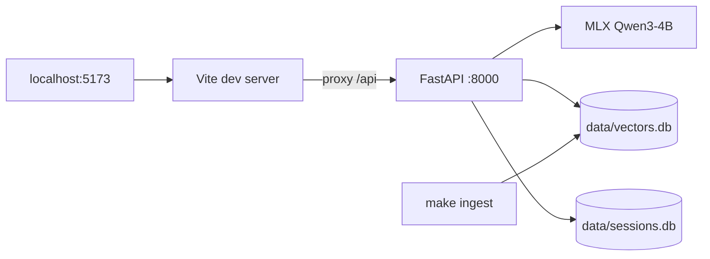
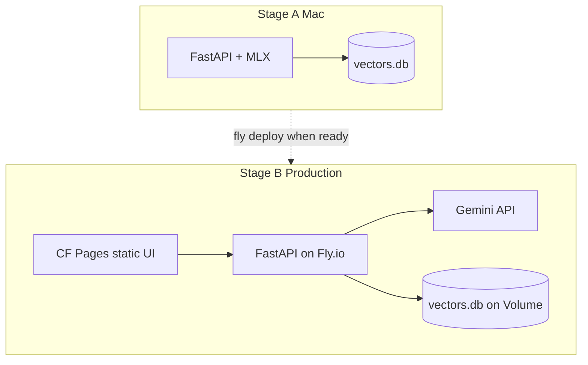
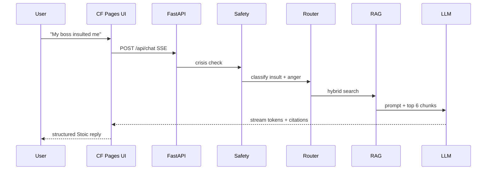
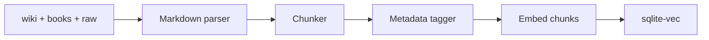
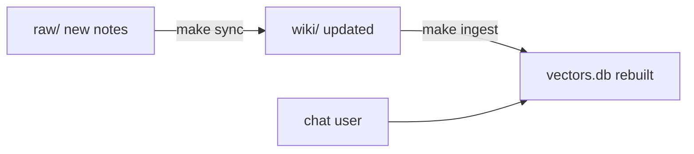

# 穩心 Steady Mind — Technical Plan

> **穩心** — 以斯多葛哲思陪伴情緒，整理當下的处境。面向中文世界（繁 / 简）；英文 **Steady Mind**。非临床心理治疗。

**Product tier:** Personal tool → **Friends beta (~5–20 people)** → public SaaS only if needed later.

**Development strategy:** **Local-first** — build and validate entirely on your Mac (MLX + FastAPI + local UI). Deploy to **CF Pages + Fly.io + Gemini** only when RAG quality and chat experience are good enough for friends.

---

## Branding（中文世界）

| Field | 繁體 | 简体 |
|-------|------|------|
| **主名称** | **穩心** | **稳心** |
| **副标题** | 斯多葛情緒哲思 | 斯多葛情绪哲思 |
| **标语** | 用哲學整理情緒，在可控處用力 | 用哲学整理情绪，在可控处用力 |
| **英文名** | **Steady Mind** | **Steady Mind** |
| **英标** | Stoic wisdom for everyday emotions | (same) |

| 技术项 | 值 |
|--------|-----|
| **CF Pages** | `https://steady-mind.pages.dev` |
| **Fly.io** | `steady-mind-api` → `https://steady-mind-api.fly.dev` |
| **默认语言** | `zh-Hant`（繁体）；支持 `zh-Hans` 切换 |
| **API** | `lang: "zh-Hant" \| "zh-Hans" \| "en" \| "auto"` |

**中文「穩心」↔ 英文 Steady Mind：**

| 字 | 含义 | 英文 |
|----|------|------|
| **穩** | 平稳、不被外境带走；斯多葛 equanimity / 情绪韧性 | **Steady** |
| **心** | 心智、情绪（非心脏） | **Mind** |

**为何这一对：**

- **稳心** — 贴 respond not react、控制二分；与冥想类「静心」区分开  
- **Steady Mind** — 直译自然，英语母语者易懂；比 Still Mind（偏「静止」）更贴「穩」  
- **URL** `steady-mind` — 与英文名一致，好记  

**备选英文（未采用）：** *Steadfast Mind*（更文、更 Stoic，略长）；*Still Mind*（适合「静心」，不适合「稳心」）

**UI 示意：**

```
┌─────────────────────────────────────────┐
│  穩心                        Steady Mind │
│  斯多葛情緒哲思 · 哲學反思工具，非醫療服務      │
├─────────────────────────────────────────┤
│  此刻的感受是？                            │
│  [ 憤怒 ] [ 悲痛 ] [ 被冒犯 ] [ 焦慮 ]      │
└─────────────────────────────────────────┘
```

简体：稳心、斯多葛情绪哲思、愤怒、悲痛…

---

## Implementation Todos

### Stage A — Local only (do first, $0)

- [ ] Build `scripts/ingest.py`: chunk wiki + books + raw, tag emotions, embed into sqlite-vec
- [ ] Implement hybrid retriever in `app/backend/services/retriever.py`
- [ ] `LLMProvider`: **MLX only** first; Gemini provider stub for later
- [ ] FastAPI `/api/chat` SSE + safety + session memory (localhost)
- [ ] Vite + React chat UI; `make dev` → `:5173` proxy → `:8000`
- [ ] CLI: `python -m scripts.query "..."` for quick RAG tests
- [ ] `make ingest` / `make dev` / `make serve`; gitignore `data/`

### Stage B — Online deploy (when local version works)

- [ ] Add `GeminiProvider` for prod; `EMBEDDING_PROVIDER=gemini` on Fly
- [ ] CF Pages deploy config (`_redirects`, `VITE_API_URL`)
- [ ] Fly.io: `fly.toml` + `Dockerfile` + Volume + secrets
- [ ] Friends beta: invite password + rate limits + privacy disclaimer

**Gate for Stage B:** local chat returns grounded, useful Stoic replies with citations; prompt template stable; you would use it yourself daily.

---

## Constraints

| Decision | Choice |
|----------|--------|
| **Build order** | **Local-first** on Mac → deploy online when ready |
| **Product type** | Personal companion web app (Jamstack + API), not blog/wiki |
| **UI** | Vite + React + Tailwind + shadcn/ui |
| **Local stack** | `make dev` = Vite `:5173` + FastAPI `:8000` + MLX + bge-small |
| **Online stack** | CF Pages (UI) + Fly.io (API) + Gemini — **Stage B only** |
| **Code** | GitHub repo (`dev.research`) |
| **Dev LLM** | Local MLX on Apple Silicon (free, private) |
| **Prod LLM** | Gemini 2.0 Flash (when deployed) |
| **Prod API** | Fly.io (~$3–5/mo) — deploy later |
| **Database** | sqlite-vec + SQLite — same files local & prod |
| **Audience** | You first → friends beta after deploy |
| **Content** | `wiki/` + `books/` + `raw/` |

---

## High-Level Architecture

### Stage A — Local (build here first)

Everything runs on your Mac. **No Cloudflare, no Fly.io, no API keys, $0.**



```bash
make ingest          # wiki + books → vectors.db
make dev             # frontend + backend together
# open http://localhost:5173
```

### Stage B — Online (deploy when local works)

Same code; swap MLX → Gemini, add hosting.



### Request flow (one message)



---

## What AI Does (and Does Not Do)

| Step | Uses AI? | Role |
|------|----------|------|
| Crisis detection | No (rules) | Stop + show hotlines |
| Situation routing | Rules (+ optional MLX) | Map message → `anger`, `grief`, `insult`, etc. |
| Vector retrieval | Yes (embeddings) | Find relevant wiki/book chunks |
| **Reply generation** | **Yes (core)** | Turn retrieved knowledge into guided conversation |
| Citations | Semi-auto | Chunks carry source metadata |

**AI is the "Stoic guide"** — your markdown is the textbook, RAG is lesson prep, the LLM delivers a structured lesson for the user's situation. It is not a therapist and does not invent doctrine.

**Deliberately not AI:** disclaimers, crisis responses, knowledge storage (markdown files), concept taxonomy.

---

## Tech Stack

| Layer | Choice | Why |
|-------|--------|-----|
| Frontend | **Vite + React + TypeScript + Tailwind + shadcn/ui** | SPA chat app; CF Pages friendly; SSE ecosystem |
| Static hosting | **Cloudflare Pages** | Free CDN, git-push deploy |
| Source control | **GitHub** | Code + content; CF Pages connects to repo |
| Backend | **FastAPI + Python 3.11+** | Same codebase dev & prod |
| LLM dev | **mlx-lm** (`Qwen3-4B-Instruct-4bit`) | Local prompt/RAG tuning, zero API cost |
| LLM prod | **Gemini 2.0 Flash** | Cheap, fast, good EN/ZH; matches `GEMINI.md` |
| LLM switch | `LLMProvider` + `LLM_PROVIDER` env | One interface, two backends |
| Embeddings dev | `bge-small` local (Mac MPS) | Free during `make ingest` + local dev |
| Embeddings prod | **Gemini `text-embedding-004`** | No model on VPS; ~$0.00001/query; server stays tiny |
| Vector DB | **sqlite-vec** (`data/vectors.db`) | Single file, ~500 chunks, zero ops |
| Session DB | **SQLite** (`data/sessions.db`) | Chat history, isolated by `session_id` |
| Prod hosting | **Fly.io** (recommended) | Small always-on machine + Volume; alt: Hetzner VPS if you want €4 fixed |

### LLM Provider abstraction

```python
# app/backend/services/llm_provider.py
class LLMProvider(Protocol):
    async def stream_chat(self, messages: list[dict]) -> AsyncIterator[str]: ...

class MLXProvider(LLMProvider):      # dev
class GeminiProvider(LLMProvider):   # prod
class OpenAIProvider(LLMProvider):   # prod alt
```

```bash
# .env.development
LLM_PROVIDER=mlx

# .env.production
LLM_PROVIDER=gemini
GEMINI_API_KEY=...
```

RAG, router, safety, and prompt builder **do not change** when switching LLM — only the final text generation layer.

---

## Deployment

> **You are here:** Stage A (local). CF Pages + Fly.io docs below are for Stage B — skip until local chat works.

### Stage A — Local development (now)

```bash
make ingest
make dev
# Browser: http://localhost:5173
# API:      http://localhost:8000
# LLM:      MLX (local, private)
# Embeddings: bge-small on Mac
# Cost:     $0
```

No Cloudflare account needed yet. No Fly.io. No `GEMINI_API_KEY`.

### When to move to Stage B

| Ready? | Signal |
|--------|--------|
| ✅ | RAG returns relevant wiki/book chunks for your test prompts |
| ✅ | MLX replies follow the 6-step template and cite sources |
| ✅ | You'd actually use it after a bad day |
| ✅ | Safety/crisis path behaves correctly |
| ⏸️ | Then: add Gemini provider, deploy Fly + CF Pages |

### Stage B — Production (friends can use without your Mac)

```
GitHub push
    ├── CF Pages  →  https://steady-mind.pages.dev      (static UI, free)
    └── Fly.io    →  https://steady-mind-api.fly.dev    (FastAPI + RAG)
                              ├── Gemini Flash (chat)
                              └── Gemini Embedding (query only)
```

**Why Fly.io:** cheaper than Railway (~$3–5 vs $5+), always-on (no cold start), persistent Volume for sqlite, Docker deploy from GitHub. With Gemini embeddings on the server, a **256MB–512MB** machine is enough for friends beta.

### Fly.io configuration

```toml
# fly.toml (sketch)
app = "steady-mind-api"
primary_region = "sin"          # or hkg, lax — pick nearest users

[http_service]
  internal_port = 8000
  force_https = true
  auto_stop_machines = false     # always-on for chat
  min_machines_running = 1

[[vm]]
  size = "shared-cpu-1x"
  memory = "512mb"               # 256mb ok if no local embedding model

[mounts]
  source = "stoic_data"
  destination = "/data"          # vectors.db + sessions.db
```

```dockerfile
# Dockerfile — slim image, no torch/sentence-transformers in prod
FROM python:3.11-slim
WORKDIR /app
COPY app/backend/requirements-prod.txt .
RUN pip install --no-cache-dir -r requirements-prod.txt
COPY app/backend/ .
# Option A: COPY pre-built vectors.db into image (no volume needed for beta)
# Option B: rely on Fly Volume at /data (recommended for session persistence)
CMD ["uvicorn", "main:app", "--host", "0.0.0.0", "--port", "8000"]
```

```bash
# First-time deploy
fly launch
fly volumes create stoic_data --size 1 --region sin
fly secrets set GEMINI_API_KEY=... LLM_PROVIDER=gemini BETA_ACCESS_TOKEN=...
fly deploy

# After wiki update: ingest locally, copy DB to volume
make ingest
fly ssh sftp shell   # or: fly deploy with COPY vectors.db in Dockerfile
```

### Environment

```bash
# CF Pages (dashboard)
VITE_API_URL=https://steady-mind-api.fly.dev

# Fly.io secrets
LLM_PROVIDER=gemini
GEMINI_API_KEY=...
EMBEDDING_PROVIDER=gemini        # text-embedding-004 in prod
BETA_ACCESS_TOKEN=...
DATABASE_PATH=/data              # vectors.db + sessions.db on Volume
```

```python
# FastAPI CORS
allow_origins=["https://steady-mind.pages.dev", "http://localhost:5173"]
```

### Development (unchanged)

```bash
make ingest                    # build vectors.db from wiki + books + raw
LLM_PROVIDER=mlx make dev      # FastAPI :8000 + Vite :5173 (proxy /api)
```

```ts
// vite.config.ts — dev proxy avoids CORS
server: { proxy: { '/api': 'http://127.0.0.1:8000' } }
```

### What cannot run on Cloudflare alone

| Component | CF Pages | Fly.io |
|-----------|----------|--------|
| React static UI | Yes | — |
| FastAPI + RAG | No | Yes |
| MLX | No | No |
| Gemini API calls | No (needs backend) | Yes |
| sqlite-vec + sessions | No | Yes (Volume) |

### Hosting: cheap + performance

| Platform | ~/month | Fit |
|----------|---------|-----|
| **Fly.io** | **$3–5** | ✅ **Recommended** — PaaS, Volume, SSE, small machine |
| Hetzner VPS | ~€4 | More RAM per €; you manage Linux/nginx |
| Railway | ~$5+ | Easier docs; slightly pricier |
| Render free | $0 | Cold start — bad for chat |

**Prod cost optimization:** ingest embeddings with `bge-small` on Mac; store vectors in sqlite. At query time use **Gemini Embedding API** only for the user message (~1 call/chat). Server runs FastAPI + sqlite only → **512MB Fly machine** handles friends beta easily.

### Optional offline browse mode

At `make ingest`, also export `data/chunks.json`. Bundle in static build for read-only "browse practices by emotion" when API is down. Chat still requires the backend.

---

## Knowledge Ingestion



### Chunking rules

| Source | Split strategy | Metadata |
|--------|----------------|----------|
| `wiki/*.md` | One chunk per `###` section | `source=wiki`, `concept`, `priority=high` |
| `books/TheDailyStoic366Meditations.md` | Per `### January 1st **TITLE**` | `source=daily_stoic`, `date`, `theme` |
| `books/沉思录.md` | Per `# 卷 N` or paragraph groups | `source=meditations`, `volume`, `lang=zh` |
| `raw/2026-04-07-notes-on-stoicism.md` | Per `####` / `#####` section | `source=irvine_notes`, `topic`, `lang=zh` |

### Emotion/situation tags

Aligned with `wiki/INDEX.md`:

`anger`, `grief`, `insult`, `reputation`, `control`, `social_conflict`, `present_moment`, `negative_visualization`, `general`

Tag via rule-based filename + heading keywords (MVP); optional MLX classifier later.

### Hybrid retrieval

```
final_score = 0.5 * cosine_sim + 0.3 * concept_match + 0.2 * source_boost
```

- `source_boost`: wiki=1.0, irvine_notes=0.9, daily_stoic=0.8, meditations=0.7
- Return top **6 chunks** (~2k tokens context)

---

## Conversation Flow

### Response template (system prompt)

1. **Acknowledge** — validate feeling without amplifying
2. **Stoic distinction** — control vs. not in control (`wiki/dichotomy-of-control.md`)
3. **Reframe** — "It's not the event, but your judgment" (Epictetus)
4. **Concrete practice** — 1–2 exercises from retrieved content
5. **Anchor quote** — short passage from corpus
6. **Follow-up question** — encourage reflection, not dependency

### Situation → practice mapping

| User says | Route to | Key practices |
|-----------|----------|---------------|
| Anger at trivial things | `anger` | impermanence, don't waste life on anger |
| Grief / loss | `grief` | negative visualization, reason trims excess grief |
| Public insult | `insult` | truth-check, humor, ignore |
| Fear of judgment | `reputation` | internalize goals, indifference to opinion |
| Anxiety about outcome | `control` | three categories, internalize goals |

---

## API Design

```
POST /api/chat
  body: { session_id, message, lang?: "en"|"zh"|"auto" }
  headers: { X-Beta-Token: "..." }   # friends beta
  response: SSE { type: "token"|"citation"|"done", data }

GET  /api/health
POST /admin/reindex    # dev only
```

**Session memory:** last 6 turns in `sessions.db`; older turns summarized to 3 sentences. Each browser gets a `session_id` (UUID in `localStorage`) — no login for beta.

---

## Friends Beta

Small trial does **not** need full SaaS. Add gate + rate limits + privacy disclosure.

### Access control

| Option | How | When |
|--------|-----|------|
| **A. Invite password (recommended)** | Frontend gate → `X-Beta-Token` header; API validates | 5–20 friends |
| **B. Cloudflare Access** | Email OTP on Pages URL | Zero backend auth code |
| **C. Secret URL only** | Share link privately | Lazy, weak security |

Also: `robots.txt` noindex; don't link from public blog.

### Session isolation

- No user accounts; `session_id` per browser
- No cross-device sync in beta
- Optional TTL purge on `sessions.db` (30 days)

### Rate limits

| Limit | Value |
|-------|-------|
| Per `session_id` / hour | 20 messages |
| Per IP / day | 50 messages |
| Max message length | 2000 chars |
| Concurrent SSE per IP | 2 |

### Privacy (friends beta)

On first visit, user must acknowledge:

1. Philosophical tool, not therapy or crisis support
2. Conversations processed by cloud AI (Gemini) — avoid highly sensitive personal data
3. Crisis: call professional hotlines (988, etc.)

### Cost estimate (10 friends, ~10 rounds/day each)

| Item | ~/month |
|------|---------|
| CF Pages | **$0** |
| Fly.io (512MB, always-on) | **$3–5** |
| Gemini Flash + Embedding | **$1–3** |
| **Total** | **~$4–8** |

### Not building in beta

User registration, OAuth, admin dashboard, billing, chat export, public SEO.

---

## Safety Layer

1. **UI disclaimer** on every session
2. **Crisis keyword detector** (rules): self-harm, suicide, abuse → stop LLM, show hotlines
3. **Scope limits** in system prompt: no diagnosis, no medication advice
4. **Grounding guard**: low retrieval score → "I don't have a strong passage for this"

---

## Repo Layout

```
dev.research/
├── plan.md                      # this file
├── app/
│   ├── backend/
│   │   ├── Dockerfile           # prod: slim, no torch
│   │   ├── requirements-prod.txt
│   │   ├── main.py
│   │   ├── routes/chat.py
│   │   ├── services/
│   │   │   ├── router.py
│   │   │   ├── retriever.py
│   │   │   ├── prompt.py
│   │   │   ├── llm_provider.py  # MLX + Gemini
│   │   │   └── safety.py
│   │   └── models/schemas.py
│   └── frontend/
│       ├── src/
│       │   ├── App.tsx
│       │   ├── components/Chat.tsx
│       │   └── hooks/useChatStream.ts
│       ├── public/_redirects    # /* /index.html 200
│       └── package.json
├── scripts/
│   ├── ingest.py
│   ├── query.py                 # CLI test
│   ├── chunkers/
│   └── tagger.py
├── data/                        # gitignored
│   ├── vectors.db
│   ├── sessions.db
│   └── chunks.json              # optional offline browse
├── prompts/
│   └── stoic_therapist.md
├── books/                       # existing
├── wiki/                        # existing
├── raw/                         # existing
├── fly.toml                     # Fly.io config
└── Makefile                     # ingest | dev | serve | deploy
```

---

## Content Maintenance Loop



- **Compile** (`raw/` → `wiki/` via `GEMINI.md`) keeps concepts current
- **Ingest** (`wiki/` + `books/` → vector DB) keeps chatbot knowledge current
- **Audit** catches wiki duplication before it pollutes retrieval

---

## Phased Delivery

### Stage A — Local MVP (do first, ~3–5 days)

**Goal:** Full chat loop on Mac, $0, private.

| Phase | Work | Deliverable |
|-------|------|-------------|
| **A1** | Ingest + RAG | `make ingest`, CLI query works |
| **A2** | FastAPI + MLX | `curl`/SSE chat on `:8000` |
| **A3** | Local web UI | `make dev` → chat in browser |
| **A4** | Tune prompt | Good replies for anger/grief/insult scenarios |

**Exit criteria:** 5+ test conversations you're happy with; citations correct.

### Stage B — Online deploy (~1–2 days, when Stage A passes)

| Phase | Work | Deliverable |
|-------|------|-------------|
| **B1** | Gemini provider + prod embedding | Same API, `LLM_PROVIDER=gemini` |
| **B2** | Fly.io | `fly deploy`, Volume, secrets |
| **B3** | CF Pages | Static UI → `VITE_API_URL` → Fly |
| **B4** | Friends beta | Password gate, rate limits, disclaimer |

### Stage C — Polish (ongoing)
- Finish Daily Stoic notes in `raw/` → re-ingest
- Meditations (`沉思录.md`) Chinese retrieval
- Emotion starter buttons in UI
- Fine-tune adapter on wiki at 100+ pages (`notes.md` vision)

---

## Risks and Mitigations

| Risk | Mitigation |
|------|------------|
| Shallow MLX dev replies | Wiki-first retrieval + strict template; prod uses Gemini |
| Noisy book chunks | Per-meditation chunking; strip epub artifacts |
| EN/ZH mismatch | `lang` metadata; respond in user's language |
| User expects therapy | Disclaimer + crisis routing |
| Stale vector index | `make ingest` after wiki edits; `last_indexed_at` in `/health` |
| Friends abuse API | Rate limits + invite password |
| Session data on shared server | Isolate by `session_id`; TTL purge; disclose cloud AI |
| API bill spikes | Per-session and per-IP rate limits |

---

## Success Criteria

### Stage A (local)

- `make ingest` builds searchable index from wiki + books
- `make dev` → chat in browser at `localhost:5173`
- Emotion/situation in → structured Stoic reply with **real citation**
- First token < 3s on Mac; fully offline after model download
- **$0** — no cloud accounts required

### Stage B (online, later)

- Same quality as local, via Gemini on Fly.io
- Friends access via CF Pages URL without your Mac running
- Invite gate + rate limits; ~$4–8/month total
- `make ingest` → redeploy refreshes knowledge base
